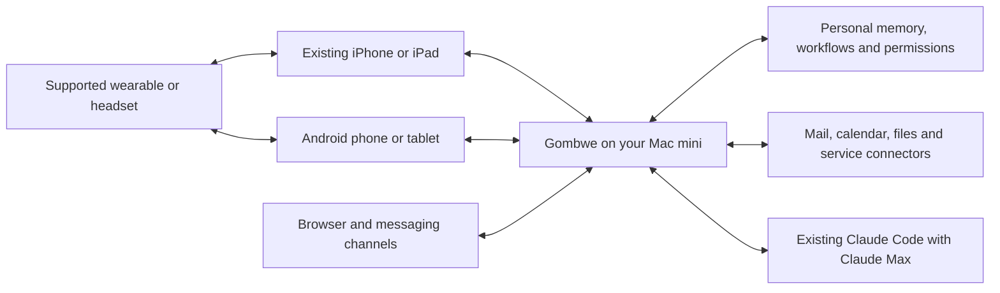

# Gombwe as the personal assistant: philosophy, evidence and build entry point

Updated September 11, 2026. This is the entry point for the implementation packet. The user wants a central personal agent hosted first on their existing Mac mini, using existing Apple/Android devices and their choice of models. It supersedes the earlier instruction to omit hardware from the comparison: the **comparison includes everything; the build reproduces outcomes wherever feasible and explicitly excludes physical hardware fabrication**.

## Current release: Claude Max first

Current release: preserve the existing Claude Code runtime using the owner's Claude Max subscription. Model independence, alternative providers, local LLM deployment and paid inference APIs are deferred until the existing experience is polished and the owner explicitly reopens that work. Do not introduce API keys, metered fallback, new paid media services, or provider-abstraction work. Use existing native/host utilities where practical; missing capabilities remain gaps.

The immediate product is the assistant the owner already runs, made reliable and easy to use. Model choice remains a later ambition, not a launch requirement. The Mac mini hosts orchestration and personal state; Claude reasoning still uses the existing Anthropic-backed subscription path. Do not call that fully local inference.

## Does the previous prompt capture the philosophy?

Partly. It captured self-hosting, old-phone support, selectable inference and native clients. It did not sufficiently establish Gombwe as the durable owner of the user's context, memory, capabilities and ongoing work. It also removed the hardware rows, making it harder to distinguish genuinely physical requirements from software and vendor restrictions. The revised prompt and complete matrix correct that. The broader model-choice vision below is future context only; the current-release boundary above controls implementation.

**The assistant stays with the person. Phones are replaceable interfaces; models are replaceable engines; Gombwe preserves the continuity.**

Your Mac mini is the first home for Gombwe's state and orchestration. It may perform local inference where its actual memory and compute permit, invoke another machine you own, or call a chosen frontier model. Owning the assistant does not require owning the largest model. A native phone app brings the camera, microphone, display, location and permissioned device actions to the same assistant. Keeping an iPhone, Apple Watch or AirPods remains an option; using Android should not mean starting again.

The intended advantage is practical: better task completion using a suitable powerful model, reusable personal context across services, persistent automations, and the ability to change providers without losing your assistant. The design should not require buying new AI hardware, using a mandatory Gombwe cloud account, or binding your data to one model's conversation format.

This is not yet proven superiority. A stronger model does not automatically fix unreliable connectors, poor retrieval, latency, missing permissions or a confusing app. The build must demonstrate the advantage on tasks, with failures and tradeoffs visible.

## Read the packet in this order

1. [Complete Apple event matrix](apple-event-complete-matrix.md): every material transcript announcement, including physical products and release claims, classified by requirement and Mac-mini-based alternative.
2. [Existing Gombwe capability audit](gombwe-current-capability-audit.md): what source actually implements, what is an agent instruction/skill, what is missing, and what was not verified live.
3. [AI implementation inventory](apple-event-feature-inventory.md): the focused 43-entry AI worklist retained from the previous extraction. The complete matrix is authoritative for full event coverage.
4. Expert-team implementation prompt (retired 2026-09-27; superseded by docs/superpowers/specs/2026-09-27-muse-parity-design.md): architecture, integration responsibilities, milestones, acceptance tests and release preparation.
5. Launch instructions (retired 2026-09-27; superseded by docs/superpowers/specs/2026-09-27-muse-parity-design.md): a copy/paste agent instruction and executable local Gombwe dispatcher.

## Build boundary: record gaps, do not chase them

The latest instruction is explicit: do not spend engineering time on what this Mac-mini-first assistant cannot practically deliver. Health sensor/clinical accuracy, biological-age/readiness validation, lab partnerships, special wearable hardware, real-time optical control, proprietary OS behavior and elaborate substitute-device schemes are **GAP_ONLY**. Their presence in the comparison does not authorize a research project or workaround. Dedicated health dashboards/imports are also excluded from this build; ordinary document summarization remains a general capability, not medical parity.

The [scope CSV](gombwe-build-scope.csv) has the binding decision for every row. BUILD_PARTIAL means implement only the simple host outcome described, not the full Apple mechanism. The complete matrix contains 89 grouped entries: 20 practical build entries (including partial equivalents), 7 deferred cost/capability entries, 53 gap-only entries, and 9 context entries.

## What actually depends on hardware?

| Category | Example | Mac mini plus existing devices | Conclusion |
|---|---|---|---|
| General AI computation | Mail context, calendar automation, summaries, writing, image generation/editing | Host runs a suitable model or calls the selected provider | No intrinsic requirement for a new phone AI chip. Quality and latency remain to be measured. |
| Ordinary sensing | Photograph a school notice; translate speech; recap a meeting | Existing phone/headset captures selected input; Mac mini/model processes it | Needs input hardware, usually already owned—not inherently the newly announced Apple hardware. |
| Time-sensitive sensing | Auto-shutter, focus tracking, immediate sound alerts | Fast lightweight device processing or proven low-latency host path, with heavier reasoning on the host | Remote processing alone is not always the best or reliable design. |
| Continuous wearable operation | Always-available wrist listening with low power consumption | Explicit phone/host sessions only; no new wearable integration | Equivalent always-on behavior depends on power, OS access and hardware. No blanket parity claim. |
| Health acquisition | ECG, heart-rate/HRV samples, blood biomarkers | Record sensor/clinical gap; dedicated health integration excluded | Cannot generate measurements absent sensors/tests; analysis can be separate from acquisition. |
| Proprietary/validated algorithms | Health Age, readiness, VO2 estimates | Record the missing validated capability; no research or substitute scoring | A research/data-validation dependency, not evidence that the latest phone chip is essential. |
| OS/service privileges | Stock Phone overlays, private Messages data, universal dictation/app actions | Public APIs, host bridges, explicit sharing, Gombwe surfaces and supported integrations | Access restrictions are not lack of model intelligence. A host cannot abolish the phone sandbox. |
| Physical capabilities | Variable aperture, ANC acoustics, foldable display, modem, battery, waterproofing | Use the hardware already present and its exposed APIs | Software cannot retrofit the physical feature. |
| Hardware-backed assurance | Sensor-signed image provenance, protected audio buffer | Preserve originals, signed edit history, bounded volatile buffers | Useful alternatives, but not equivalent sensor/secure-hardware guarantees. |

The Mac mini does not need to carry the camera. Input can come from a paired phone or imported file, processed by the host, and return to the same device. Drone operation is not an announced AI feature in this transcript and is not a build requirement; imported footage can use the media pipeline without adding flight control.

## Gombwe's present starting point

The repository contains a gateway, persistent sessions and tasks, a completion loop, schedules, triggers, workflows, a skill system, web/CLI/Telegram/Discord entry points, family/grocery tooling and substantial home-network functionality. The school-email/calendar behavior is described in a concrete skill with Mac Mail/Calendar integration instructions.

These are reusable foundations, not evidence of complete Apple parity. The current runtime is Claude CLI-coupled; an OpenAI-shaped proxy is not a multi-provider implementation. Native mobile clients, robust cross-provider memory, real speech/image pipelines, and secure device capability/pairing infrastructure need implementation or verification. See the audit for source-level distinctions. Website examples are not used as proof of completed connectors.

## Architecture that makes the philosophy real

Current inference uses the existing Claude subscription setup. Personal context sent to Claude is processed remotely by Anthropic. There is no local-only inference claim, no model picker and no paid API fallback. Alternative-provider/local-inference diagrams and release gates are deferred.

## Make the advantage obvious through these demonstrations

These are proposed acceptance gates, not measured achievements. Record host chip/RAM, phones, provider/model/version, date, network, language, task fixtures and costs. If comparing against Apple, test an actually available version with the same task inputs. If it is unavailable, label the comparison unmeasured rather than extrapolating from the keynote.

| Demonstration | What a user should see | Release evidence |
|---|---|---|
| School admin handled overnight | Events/reminders and corrections appear in the selected family calendar while the phone is closed | At least 40 held-out varied mail/attachment/stub fixtures; at least 95% exact required-field extraction, zero fabricated deadlines, zero cross-calendar writes, zero duplicates under retry; ambiguous items explicitly deferred. |
| Keep the existing subscription path | Same assistant works through the current Claude Code login | No new inference API key, paid fallback or provider migration; usage limits handled visibly and without duplicate actions. |
| Existing phone sees; home host reasons | Photo of a notice becomes several correct calendar proposals with source evidence | An older supported iPhone without the target Apple Intelligence capability and a midrange Android complete the same flow; source-to-action provenance and honest permission handling. |
| A single assistant follows the user | Start in one app/device and continue on another without repeating context | Same authorized state, no cross-person leakage; phone replacement does not erase workflows. |
| Useful personal context | Recall a recommendation across authorized mail/files and act on it | Held-out questions with reference answers, citation accuracy and action correctness; compare models on the same retrieval context. |
| Understand what stays on the Mac | Persistent personal state on the host; Claude request content is disclosed as remote inference | Preserve subscription authentication, redact secrets and test that no separate paid provider is called. |
| Know the media gaps | Unsupported paid-service image/video capabilities are clearly deferred | No fake artifacts or new paid subscriptions/API dependencies. |
| Voice that feels usable | Headset conversation, translation and explicit recap sessions | Transcription/translation quality, p50/p95 response latency, interruption handling, battery cost and documented background limitations. |
| Easy to set up | Pair a phone and finish one useful task | Proposed gate: 4 of 5 new testers finish within 10 minutes after host installation/existing Claude login availability, without shell commands on the phone. Report small-sample limits. |
| Economically sensible | Know the recurring cost and whether new equipment is needed | Per-task/monthly measured usage and host power estimates; hardware already owned counted explicitly. No unsupported claim that self-hosting is free. |

Health/clinical/wearable/camera-hardware gaps are excluded from the acceptance gates. Every major surface should expose the selected processing destination, task progress, sources and resulting action. Avoid filling the product with architecture jargon; use plain choices such as “My Mac mini” and “My selected cloud model.” Useful results, continuity and reliability are the selling points.

## OpenClaw comparison and evidence

The desired category matches the personal-gateway approach documented by [OpenClaw](https://docs.openclaw.ai/): an owned gateway connecting channels, tools, state and models. That is a category reference, not a claim that Gombwe already matches every OpenClaw capability. Keep Gombwe central; evaluate interoperability with useful open tool protocols without replacing this project or copying features blindly.

For implementation constraints consult the [Apple App Review Guidelines](https://developer.apple.com/app-store/review/guidelines/), [Google Play AccessibilityService policy](https://support.google.com/googleplay/android-developer/answer/10964491?hl=en), and [Apple keyboard-extension documentation](https://developer.apple.com/documentation/uikit/configuring-open-access-for-a-custom-keyboard). These constrain integration and distribution, not the computational feasibility of AI. Existing-host inference must also respect actual model memory/context requirements; [Ollama's FAQ](https://docs.ollama.com/faq) is one implementation reference, not a mandatory runtime choice.

No new product code or live personal workflow was exercised to prove the proposed parity in this packet. The launcher is a development-task dispatcher; it does not transform a prompt into a completed, tested or store-approved app.
